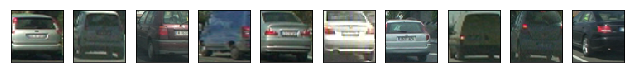

# Vehicle Detection

## Introduction

The goal of this project is to write a software pipeline to detect vehicles in a video.

The pipeline is using the following steps :

- Feature extraction: definition of a feature vector describing the images.
- Classifier training: on the features extracted from the database.
- Image preparation: Splitting a camera image into search windows
- Applying the classifier, in each window to check for the car presence
- Combining and filtering the results, to build a bounding box around the estimated car.
- repeating the process for every image in the video, and averaging the result to further filter false positives. 

### Code:
This project requires python 3.5 and the following dependencies:

- [NumPy](http://www.numpy.org/)
- [matplotlib](http://matplotlib.org/)
- [OpenCV](http://opencv.org/)
- [MoviePy](http://zulko.github.io/moviepy/)
- [glob](https://docs.python.org/2/library/glob.html)
- [pickle](https://docs.python.org/2/library/pickle.html)
- [scipy](https://www.scipy.org/)
- [skimage](http://scikit-image.org/)
- [udacity self driving lesson functions](https://classroom.udacity.com/nanodegrees/nd013)

* The code is composed of 4 files:
	* `'lesson_function.py'` contains the useful 'service' function presented during the lessons.
	* `display.py` contains the code use to generate the images for this document, not necessary to generate the final result.
	* `classification.py` contains the code used up to train the classifier and store the results (feature vector)
	* `imgprocessing.py` contains the image parameters (sliding window definition and filtering parameter) and the video processing loop.
	
## Project description
---

## Feature extraction

Performed by using a database to identify and extract image features to allow classification between cars and non-cars.

### Database review
The first step was to review the images and structure of the database.

- I used the KITI and GTI data sets as well as the Extra data that comes along with the project repository for training.
- It is composed of two classes "cars" and "not cars".
- The "cars" class is composed of 5 subsets, with a total of 8792 images. 
- The "not car" class is composed of 8968 images and 2 sub sets.
- The classes are of similar size and will not create a bias this way.
- All the pictures are of the same type  (*.png) and shape (64,64,3) and seems to correspond to their label.
- Attached are a few extracts:

"cars" sets:

"not car" sets

### Features extraction
The feature vector I used is a combination of :

- Spatial features, a down sampled version of the image

- Color histograms, a capture of the color distribution of the image. 

- Histogram of oriented gradients (HOG), a capture of the gradient structure of the image

#### Color histogram
Here is a visualisation of the RGB color histogram of a random image in the "car" set:

#### HOG features
Here is a visualisation of the HOG features for a random "car" and "not cars" pictures from the dataset.

The final feature vector contains features from the three transformation quoted above.
To avoid having some features being dominant, the data is centered and normalised before being concatenated, the  `Standard.scaler` function from the scikit library is used (`classification.py` line 55).

The parameters of the features are defined in order to maximise the classifier accuracy.
Note: HOG feature alone is enough to achieve close to 97% accuracy. (But is is too tempting not to play with all the tools available :-)

To find some good parameters I tried various combination,  I managed to get up to 99 % of accuracy. I just hope I did not overfit the data ! Here is a sample of the best results obtained :

the features parameters used are the ones presented in column 3 of the table (`classification.py` line 24-35).
## Classifier training
* A Linear SVM classifier is used to provide a good compromise between speed and accuracy.
* The first step is to randomise and split the database between a training set and a test set (`train_test_split` function (`classification.py` line 66))
* Once the classifier is trained, all the parameters are saved (using `pickle.dump` (`classification.py` line 102))

## Image processing
 
* The frames recorded by a video camera are scanned using a sliding window
* For every window, the featured vector is computed and fed to the classifier.
* To compensate for the car varying size due to the distance, a set of variable size windows is constructed. Attached a view of all the windows used (~150):

* The application of sliding window provides good results on the test images, even detecting a car in the opposite lane, nevertheless there is still some false positive.

* To filter false positives a heat map of the active windows (the ones identified as 'car' by the classifier) is computed.
* This heat map is combine to the the heat map of the preceding window using weighted coefficient, using the opencv function `cv2.addWeighted`(`lesson_functions.py` line 304).
* note: to keep a heatmap im memory a simple heatmap class have been created (`lesson_functions.py` line 291).
* The resulting heat map is then thresholded, attached is a sample of heat map before and after the filtering:

 

* From the thresholding heatmap, the bounding boxes are determined as the smallest rectangular box that contains all non zero values using the `label` method from `scipy.ndimage.measurements`(`lesson_functions.py` line 270).
* The bounding boxes are then added to the image (in red in the following pictures)

* In summary, three parameters related to image can affect the bounding box appearance:
	* The definition of the sliding windows (the set of test boxes)
	* The time filter (to try to remove false positives)
	* The detection redundancy filtering
* The car bounding boxes are quite sensitive to those three parameters, for example, a strong filtering will reduce the amount of false positives but will reduce the size of the car bounding box and may generate some false negatives as in the following image. 

## Video processing

* The pipeline is applied to every successive image and provide acceptable results, despite some remaining false positive and some false negative instances (missing the car).
* The balance between removing the false positive and avoiding false negative is quite delicate to achieve, this sensitivity makes me think that this algorithm as it is may be difficult to generalize, a stronger classifier may be investigated.
